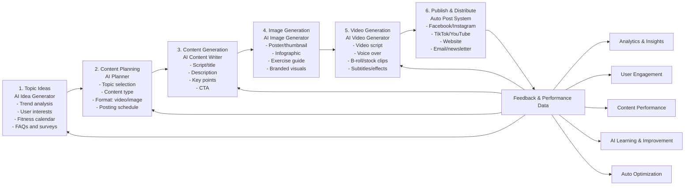

# K Fitness Center — Automated Content Creation System

This workflow follows the requested poster structure: the system automatically thinks of topics, plans content, generates captions/scripts, creates image and video briefs, publishes to channels, and learns from feedback.

## 1. Automated Content Creation Workflow



### Workflow Stages

| Step | Module | Inputs | Output | Human Approval |
| --- | --- | --- | --- | --- |
| 1 | Topic Ideas | Trends, FAQs, gym promotions, class calendar, customer comments | 10-20 weekly content ideas | Optional |
| 2 | Content Planning | Topic list, platform, target customer, campaign goal | Weekly content plan and post schedule | Required before production |
| 3 | Content Generation | Approved topic and K Fitness source of truth | Captions, scripts, titles, descriptions, CTAs | Required for offers/prices |
| 4 | Image Generation | Caption, brand colors, image format, exercise topic | Poster, thumbnail, infographic, exercise guide brief | Required before publishing |
| 5 | Video Generation | Script, visual plan, voice-over direction | Reels/Shorts/TikTok script, subtitles, shot list | Required before publishing |
| 6 | Publish & Distribute | Final assets, caption, hashtags, channel schedule | Published posts across social channels | Required for paid ads |
| 7 | Feedback Loop | Reach, views, comments, messages, signups | Improved topics, hooks, offers, and schedules | Weekly review |


## Step-by-Step Execution System

Use this system exactly one stage at a time. Do not skip approval checkpoints when prices, promotions, medical-safety wording, or paid ads are involved.

### Step 1: Topic Ideas — AI Idea Generator

1. Collect inputs from trend analysis, user interests, the fitness calendar, FAQs, and surveys.
2. Create 10-20 topic ideas for the week.
3. Tag each idea by customer goal: fat loss, muscle gain, beginner training, group class, promotion, or motivation.
4. Pick the strongest idea for the next post.

**Output:** one approved topic plus backup topics.

### Step 2: Content Planning — AI Planner

1. Choose the platform: Facebook, Instagram, Telegram, TikTok, YouTube, website, or email.
2. Choose the content type: infographic, image post, short video, long video, Q&A, poll, or motivation post.
3. Choose the format: 9:16 vertical video, 1:1 square image, 16:9 YouTube video, or text-only message.
4. Set the publish date and time.

**Output:** approved content plan with platform, format, target customer, and schedule.

### Step 3: Content Generation — AI Content Writer

1. Write the caption or script using **Question > Emotion > Trust > Offer > Close**.
2. Include K Fitness Center facts only from the source of truth.
3. Add the correct phone numbers and map link when selling or inviting customers to visit.
4. Check safety: no medical diagnosis and no exact weight-loss promise.

**Output:** ready-to-review caption, title, description, key points, hashtags, and CTA.

### Step 4: Image Generation — AI Image Generator

1. Create a poster, thumbnail, infographic, exercise guide, or branded visual brief.
2. Use K Fitness brand style: black, yellow, white, strong gym visuals, clear headline, and readable CTA.
3. Add only safe exercise cues and avoid unrealistic body-transformation claims.
4. Export the correct size for the target platform.

**Output:** final image asset or image-generation prompt ready for approval.

### Step 5: Video Generation — AI Video Generator

1. Convert the approved script into scenes.
2. Add voice-over text in the customer language: Myanmar, English, Chinese, or Myanmar-English bilingual.
3. Add B-roll or stock clip directions, subtitles, and effects.
4. Keep short videos direct: hook in the first 2 seconds, offer before the end, CTA in the final frame.

**Output:** final video asset or video-production brief ready for approval.

### Step 6: Publish & Distribute — Auto Post System

1. Upload the approved asset and caption to the selected channels.
2. Confirm contact numbers, map link, price, promotion, and CTA before posting.
3. Publish or schedule the post.
4. Save the post link and published time for tracking.

**Output:** published or scheduled content with post links.

### Step 7: Feedback & Performance Data

1. Collect analytics and insights: reach, views, watch time, saves, shares, comments, messages, and signups.
2. Review user engagement and content performance.
3. Identify what worked: hook, topic, offer, visual, language, or posting time.
4. Feed the learning back into Step 1, Step 2, Step 3, and Step 5 for auto optimization.

**Output:** next-cycle improvement notes and optimized content ideas.

### Generator Script

Run the local generator to create a complete step-by-step production brief from the workflow data:

```bash
python3 scripts/generate_content_workflow.py --topic "Beginner workout guide" --platform "Facebook / TikTok / YouTube Shorts" --language "Myanmar-English bilingual"
```

The generated brief is written to `output/k-fitness-content-brief.md`.

## 2. Content Examples for K Fitness Center

| Example Type | Purpose | Required Elements | Example Topic |
| --- | --- | --- | --- |
| Form Example | Collect member goals and preferences | Name, age, goal, experience level, exercise preference, injuries/limitations | Gym knowledge and exercise preference form |
| Infographic | Teach simple fitness knowledge | 3-5 key facts, bold title, icons, brand footer | General fitness knowledge: consistency, strength training, overload, nutrition, recovery |
| Exercise Guide Image | Demonstrate one exercise safely | Exercise name, target muscles, steps, sets/reps, safety cue | Dumbbell squat: 3 sets x 12 reps |
| Video Thumbnail | Attract clicks for long/short videos | Big title, strong body visual, platform icon, K Fitness branding | 5 best exercises for muscle building |
| Short Video Preview | Drive Reels/TikTok/Shorts engagement | Hook, 3-5 exercise clips, reps, subtitles, CTA | Leg day workout: squat, lunge, leg press, calf raise |

## 3. AI Tools and Technologies

| Function | Tool Options | K Fitness Use |
| --- | --- | --- |
| AI Writing | ChatGPT, Claude, Gemini | Captions, scripts, titles, comments, sales replies |
| Image Generation | DALL·E, Midjourney, Leonardo AI | Posters, thumbnails, infographics, branded visuals |
| Video Generation | Pictory, Synthesia, Runway ML | Reels, Shorts, TikTok videos, YouTube intros |
| Voice Over | ElevenLabs, Murf AI | Myanmar, English, or Chinese voice-over drafts |
| Automation | Make.com, Zapier, n8n | Move approved content into posting queues |
| Analytics | Google Analytics, Meta Insights, platform analytics | Track reach, engagement, messages, and signups |

## 4. Automation Process Flow

1. **Trigger** — Start by schedule, event, promotion, or manual request.
2. **AI topic research and idea generation** — Generate topics from trends, customer FAQs, fitness calendar, and promotions.
3. **Content planning and approval** — Choose platform, format, target customer, and publish date.
4. **AI content creation** — Produce text, image brief, video script, subtitle plan, hashtags, and CTA.
5. **Review and auto optimization** — Check accuracy, safety, price details, language, and sales strength.
6. **Auto publish and distribution** — Send approved content to Facebook, Instagram, Telegram, TikTok, YouTube, website, or email.
7. **Performance tracking and AI learning** — Record performance and improve the next content cycle.

## 5. Automated Output Calendar

| Day | Content Type | Topic Example | Channel |
| --- | --- | --- | --- |
| Monday | Infographic | Benefits of strength training | Instagram / Facebook |
| Tuesday | Short video | HIIT workout in 15 minutes | TikTok / Reels / Shorts |
| Wednesday | Image post | Healthy meal ideas | Instagram / Facebook |
| Thursday | Long video | Beginner workout guide | YouTube |
| Friday | Tips post | How to stay motivated | Instagram / Facebook |
| Saturday | Q&A / Poll | Ask your trainer | Instagram Stories / Telegram |
| Sunday | Motivation post | Be stronger than your excuses | Instagram / Facebook |

## 6. Benefits for K Fitness Center

| Benefit | Result |
| --- | --- |
| Save time | 100% structured content creation process |
| Consistent | Daily content without missing planning steps |
| Engage more | More follower interaction and member engagement |
| Build authority | Educate and inspire customers before they visit |
| Data-driven | Optimize topics, offers, and hooks using performance data |
| Scalable | Works for Facebook, Instagram, Telegram, TikTok, YouTube, website, and campaigns |

## Publishing Checklist

Before publishing any post, confirm:

- The caption follows **Question > Emotion > Trust > Offer > Close**.
- Contact numbers are included when the post is selling: 09966766466, 09676003533, 09675844933.
- Location or map is included when inviting customers to visit: https://maps.app.goo.gl/pDefLUxTmSoZ3RB18?g_st=ipc.
- Prices and promotions match the business source of truth.
- No medical diagnosis or guaranteed weight-loss result is included.
- Any pain, injury, dizziness, or health issue content advises consulting a qualified medical professional.

## Brand Closing Line

**Smart content. Stronger community. Better results.**

**Join us and transform your fitness journey at K Fitness Center.**
